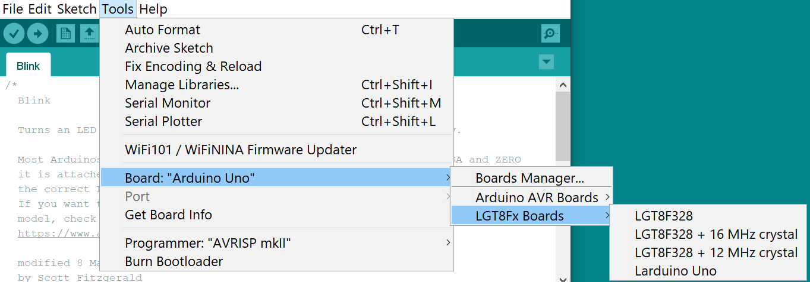
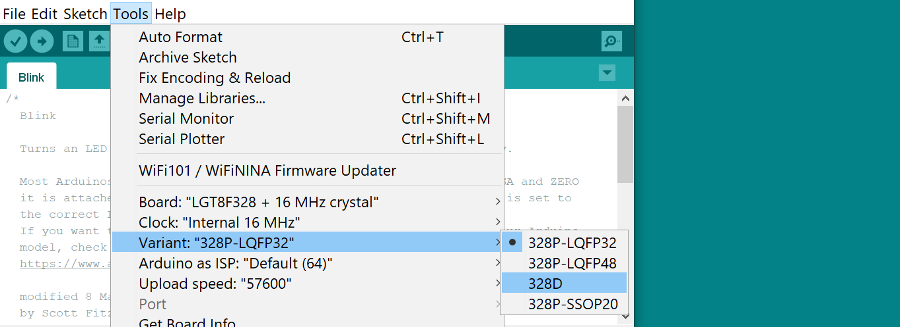
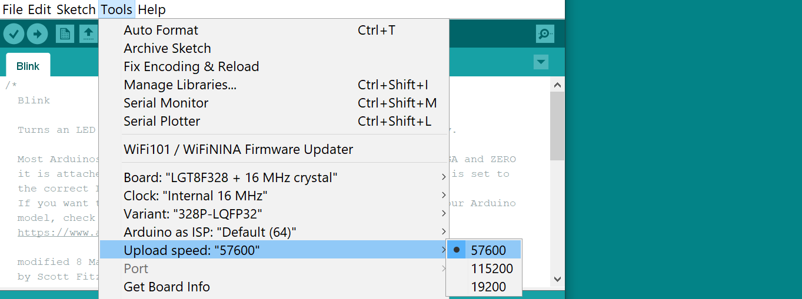

Now in v1.0.7 custom board selection is available.
- You can choose the speed of the crystal that the board equipped with.
- You can choose MCU type.
- May vary the upload speed depends on bootloader.

 
 
 
 
 
 
