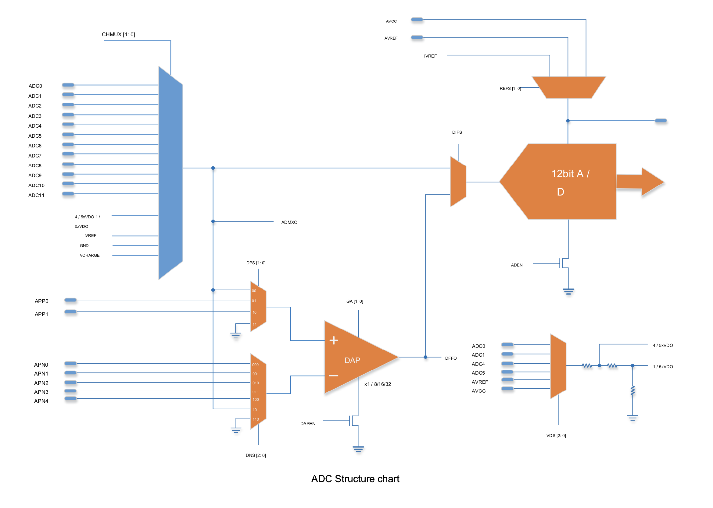

# Differential Amplifier

## Usage:

- See examples/differential_amplifier

```
int output = analogDiffRead(A0, A1, GAIN_8);
// output = (A1 - A0) * 8
int invalid_output = analogDiffRead(A0, A5, GAIN_8);
// invalid_output = -1
```

- Available pin combinations

| -\\+ | A0  | A1  | A2  | A3  | A4  | A5  | A6  | A7  | A8  | A9  |
| ---- | --- | --- | --- | --- | --- | --- | --- | --- | --- | --- |
| A0   |     | ✓   |     |     |     |     |     |     |     |     |
| A1   | ✓   |     |     |     |     |     |     |     |     |     |
| A2   | ✓   | ✓   |     | ✓   | ✓   | ✓   | ✓   | ✓   | ✓   | ✓   |
| A3   | ✓   | ✓   | ✓   |     | ✓   | ✓   | ✓   | ✓   | ✓   | ✓   |
| A4   | ✓   | ✓   |     |     |     |     |     |     |     |     |
| A5   | ✓   | ✓   |     |     |     |     |     |     |     |     |
| A6   | ✓   | ✓   |     |     |     |     |     |     |     |     |
| A7   | ✓   | ✓   |     |     |     |     |     |     |     |     |
| A8   | ✓   | ✓   | ✓   | ✓   | ✓   | ✓   | ✓   | ✓   |     | ✓   |
| A9   | ✓   | ✓   | ✓   | ✓   | ✓   | ✓   | ✓   | ✓   | ✓   |     |

Also see the examples in the `differential_amplifier` library provided with this core.

## How does it work?

### Basics

The differential amplifier (DAP) has 2 inputs (`inverting`/minus and `non-inverting`/plus), a `gain` value and 1 `output`.

```
output = gain * (non-inverting - inverting)
```

And the output can be read through the ADC (like a normal analog read).

All information was extracted from this translation of the datasheet: [(English) LGT8FX8P_databook_V1.04](../LGT8FX8P_databook_v1.0.4.en.pdf) (thanks to [metallurge](https://github.com/metallurge) for the translated doc [here](https://github.com/RalphBacon/LGT8F328P-Arduino-Clone-Chip-ATMega328P/issues/2#issuecomment-517952757))



### Algorithm:

1. Setup the inputs and gain and turn DAO on through the DAPRC (Differential amplifier control register):

   `DAPCR = DAPEN | gain | inverting | noninverting;`

   - Enable: DAPEN
   - Gain: GA[1:0]
   - Inverting input: DNS[2:0]
   - Non inverting input: DPS[1:0]
     Important: Only one input can use the multiplexer. This means that not all combinations of pins can be compared (See table in the library source)
   - 

2. Configure the ADC input to use the Differential amplifier instead of reading directly from the analog pins

   `ADCSRC |= DIFS_DIFFAMP;`

   - ADC input switch: DIFS
     

3. Setup the multiplexer if necessary and make the reading

   `int res = analogRead(inverting == INVERTING_MXER ? pin1 : pin2);`

   - For this, I'm just reusing the standard `analogRead(pin)` function which also configures the multiplexer.
   - Note: for some pin combinations it is not necessary to use the multiplexer, but for the sake of simplicity I still use the normal `analogRead(pin)` function. In this case it doesn't matter which pin is passed to the function, as the DAO won't use the output of the multiplexer.
   - 

4. Cleanup:

   - Turn DAO off:

     `DAPCR &= ~DAPEN;`

   - Undo step (3) (reconnect ADC to multiplexer for future normal analogRead calls)

     `ADCSRC &= ~DIFS_DIFFAMP;`
