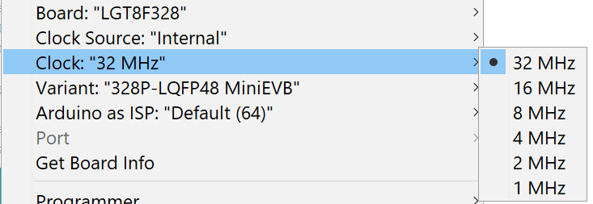
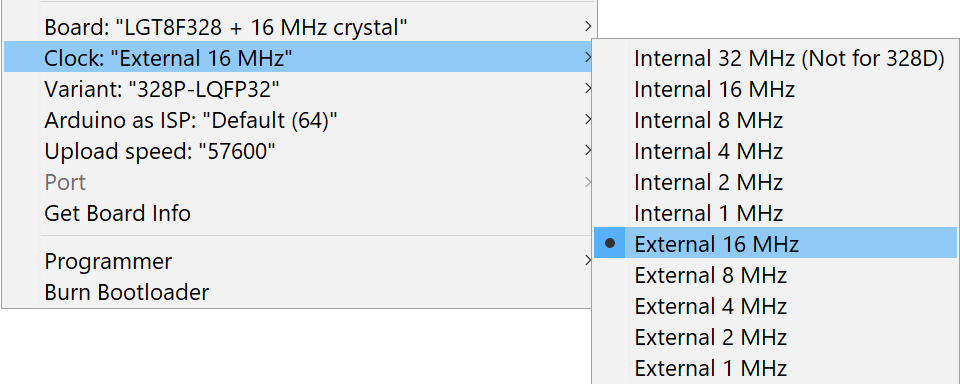
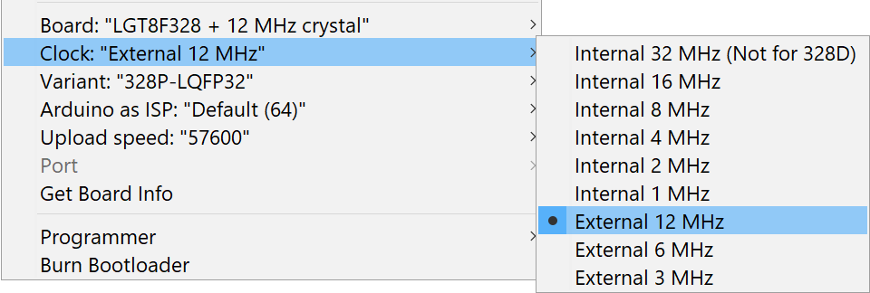
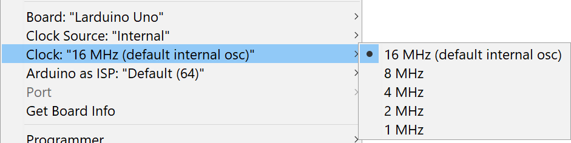

Use when an external 32MHz crystal is connected to LGT8F328P Port B Pin 6 & 7 (see databook for details, in particular about the decoupling capacitors). You can comfortably switch between the internal and external OSC using the tools menu:

And then pick the speed you want to run at (I tested 16MHz as well as 32MHz, but I kept the other options as well). This directly sets the prescaler to the correct value:

 
 

If your board equipped with 16 or 12 MHz crystal choose board "LGT8F328 + 16 MHz crystal" or "LGT8F328 + 12 MHz crystal".
 After this pick the speed you to run at.

or

 

On board Larduino Uno has no external crystal.

