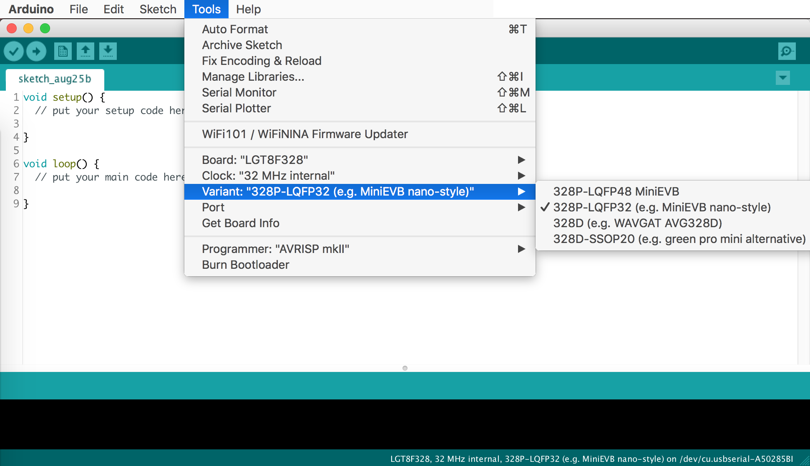
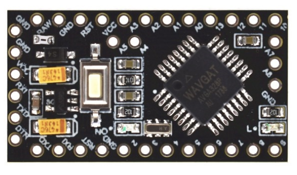
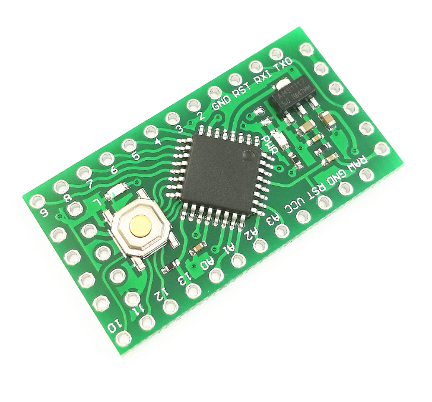

Based on https://github.com/LGTMCU/Larduino_HSP. Go there for more info.
Also there is a ton of information here: https://github.com/RalphBacon/LGT8F328P-Arduino-Clone-Chip-ATMega328P

# Board Package for Logic Green Atmel ATMEGA 328 derivates

- LGT8F328P-LQFP48
- LGT8F328P-LQFP32
- LGT8F328D
- LGT8F328D-SSOP20
- LGT8F88D-SSOP20

# How to install

Add the package to the arduino Boards Manager Urls:

- Go to Preferences
  - paste this url in Boards Manager URL: `https://raw.githubusercontent.com/dbuezas/lgt8fx/master/package_lgt8fx_index.json`
- Go to Tools/Board/Boards manager
  - Type `lgt8fx` in the search box
  - install lgt8fx

Now the boards appear in the IDE and you can also select the clock speed.

## 32Mhz is twice as fast as a conventional arduino nano!

# Features

- [x] PWM & Timers update (from larduino package)
- [x] Fast_IO update (from larduino package)
- [x] Automatic prescaler setup
- [x] In Menu support of 1, 2, 4, 8, 16 and 32 Mhz
- [x] Digital Analog Converter works
- [ ] Analog Comparator
- [ ] Differential Amplifier update
- [ ] Computation Accelerator

# Power consumption

- 32Mhz 32.6mA
- 16Mhz 27.8mA
- 8Mhz 25.4mA
- 4Mhz 24.3mA
- 2Mhz 23.4mA
- 1Mhz 22.8mA

# Tested in these Boards:

## Wavgat Pro Mini clone

## LGT8F328p SSOP20

## Pro Mini style LQF32

## Nano style LQF32

## It also works fine from VSCode

# Disclamer

I have no association with Arduino, Logic Green, Atmel or anything. I just wanted to have a convenient way to use these boards and get them to work without hacks at 32Mhz
