# How to install

Add the package to the arduino Boards Manager Urls:

- Go to Preferences
  - paste this url in Boards Manager URL: `https://raw.githubusercontent.com/dbuezas/lgt8fx/master/package_lgt8fx_index.json`
- Go to Tools/Board/Boards manager
  - Type `lgt8fx` in the search box
  - install lgt8fx

Now the boards appear in the IDE and you can also select the clock speed.

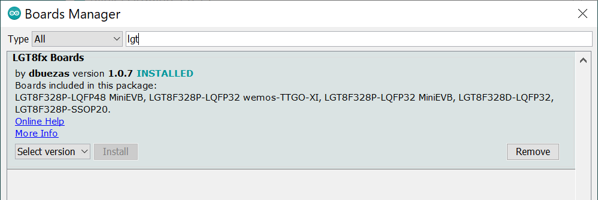
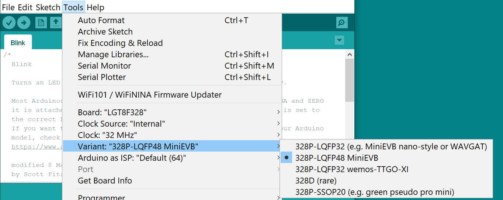
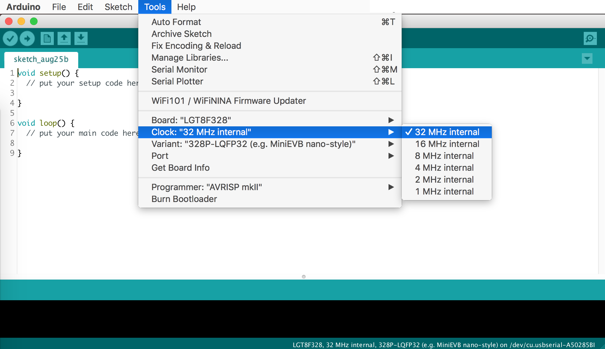
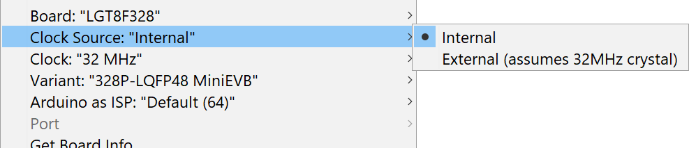

32Mhz is twice as fast as a conventional arduino nano! Actually _even faster_ as many operations take less clock cycles than in the atmega328p. Check out some [benchmarks](https://github.com/dbuezas/lgt8fx/discussions/77)
# Discussions, ideas, questions and show your project
Explore the discussions: https://github.com/dbuezas/lgt8fx/discussions

# Features

- [x] [Fast_IO update](./lgt8f/libraries/lgt328p/examples/lgt8fx8p_fastio/lgt8fx8p_fastio.ino)
- [x] [Automatic prescaler setup](./lgt8f/cores/lgt8f/main.cpp#L126)
- [x] [In Menu support of 1, 2, 4, 8, 16 and 32 Mhz](./lgt8f/boards.txt)
- [x] [Digital Analog Converter](./lgt8f/libraries/lgt328p/examples/dac0_sinus/dac0_sinus.ino)
- [x] [Voltage References](./lgt8f/libraries/lgt328p/examples/adc_i2v56/adc_i2v56.ino) INTERNAL1V024/INTERNAL2V048/INTERNAL4V096/DEFAULT/EXTERNAL (useful for example for analogRead or DAC analogWrite via analogReference(xxx));
- [ ] Analog Comparator (page 224 of datasheet v1.0.4)
- [x] [Differential Amplifier](./docs/differential-amplifier/readme.md). See this [Example](./lgt8f/libraries/differential_amplifier/examples/all_vs_all/all_vs_all.ino).
- [ ] Computation Accelerator (page 52 of datasheet v1.0.4) [Work by others](https://www.avrfreaks.net/comment/2272366#comment-2272366)
- [x] [SoftwareSerial at any clock speed](https://github.com/dbuezas/lgt8fx/pull/26). Updated implementation without timing tables by [#jg1uaa](https://github.com/jg1uaa)
- [x] [In-menu external clock support](./docs/external-clock/readme.md) (by [#seisfeld](https://github.com/seisfeld))
- [x] [2 to 6 high current 80ma IO pins](https://github.com/dbuezas/lgt8fx/issues/21#issuecomment-657020605) (thanks [#rokweom](https://github.com/rokweom))
- [x] [328p Arduino ISP](https://github.com/dbuezas/lgt8fx/blob/master/lgt8f/libraries/LarduinoISP/readme.md) (from [#brother-yan](https://github.com/brother-yan/LGTISP))
- [x] [SSOP20 328p Support](https://github.com/dbuezas/lgt8fx/pull/16) (by [#LaZsolt](https://github.com/LaZsolt))
- [ ] (in next release) [Precise delayMicroseconds](https://github.com/dbuezas/lgt8fx/issues/18) (by [#LaZsolt](https://github.com/LaZsolt))
- [ ] (in next release) [Faster Analog Read](https://github.com/dbuezas/lgt8fx/pull/32) (by [#jayzakk](https://github.com/jayzakk))
- [ ] (in next release) [Fixed analogReference](https://github.com/dbuezas/lgt8fx/issues/27) (reported by [#macron0](https://github.com/macron0))
- [ ] (in next release) [Enabled AREF pin as A10 analog input](https://github.com/dbuezas/lgt8fx/pull/36) (by [#jayzakk](https://github.com/jayzakk))
- [ ] (in next release) [Power reduce register definitions](https://github.com/dbuezas/lgt8fx/pull/46) (by [#KooLru](https://github.com/KooLru))
- [ ] (in next release) [Support for interrupts on all timers and comparators](https://github.com/dbuezas/lgt8fx/pull/40) (by [#jayzakk](https://github.com/jayzakk))
- [ ] (in next release) [Arduino EEPROM API](https://github.com/dbuezas/lgt8fx/pull/64) (by [#SuperUserNameMan](https://github.com/SuperUserNameMan)

# Differences to original core [Larduino_HSP v3.6c](https://github.com/Edragon/LGT/tree/master/HSP%20Patch%20File/Larduino_HSP_3.6c/Larduino_HSP_v3.6c)

- Support 32 Mhz and other clock speeds
- Differential Amplifier API
- Better Boards Menu
- Installation via Board Manager Urls
- SoftwareSerial @32Mhz
- FastIO ported from https://github.com/LGTMCU/Larduino_HSP

# Power consumption @ 5v

| Clock | Pro mini style w/o power LED | Pro mini style | Nano style |
| ----- | ---------------------------- | -------------- | ---------- |
| 32MHz | 12.7mA                       | 15.0mA         | 32.6mA     |
| 16MHz | 9.2mA                        | 11.5mA         | 27.8mA     |
| 8MHz  | 7.1mA                        | 9.4mA          | 25.4mA     |
| 4MHz  | 5.9mA                        | 8.2mA          | 23.3mA     |
| 2MHz  | 5.3mA                        | 7.6mA          | 23.4mA     |
| 1MHz  | 5.0mA                        | 7.3mA          | 22.8mA     |

# Example boards:

## LGT8F328P-LQFP32

### [WAVGAT Pro Mini Pseudo Clone](../../wiki/WAVGAT-Pro-Mini-Pseudo-Clone)

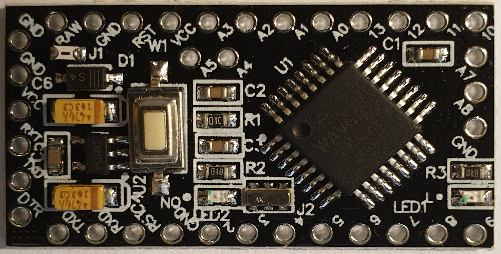
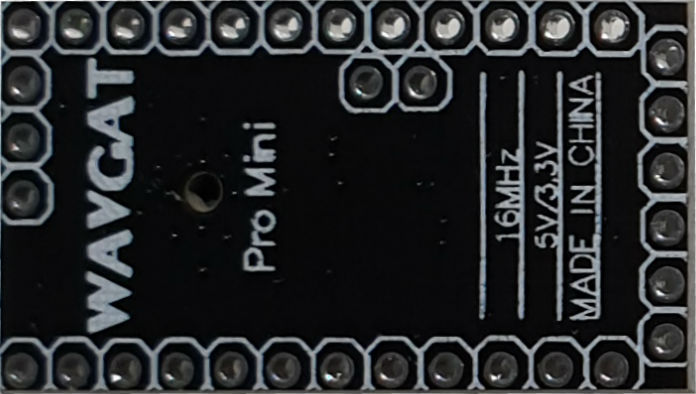

### Pro Mini style LQFP32

### Larduino Uno LQFP32

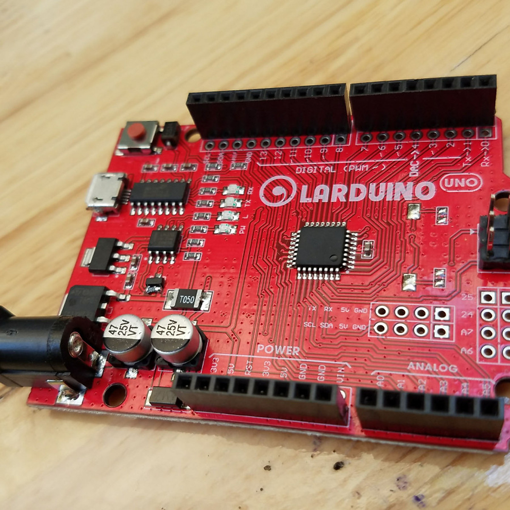
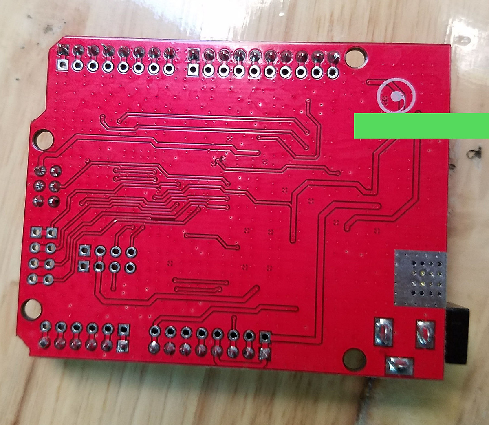

### [Nano Style](../../wiki/Nano-Style)

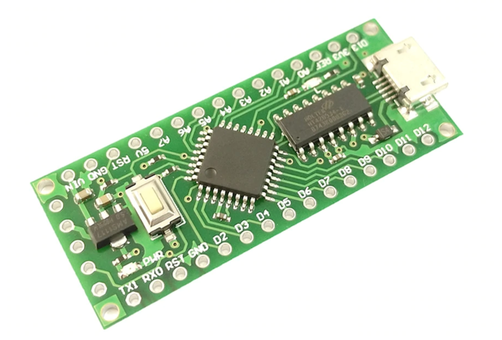
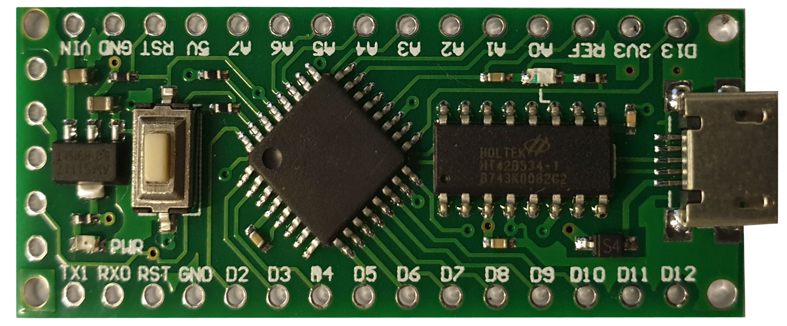
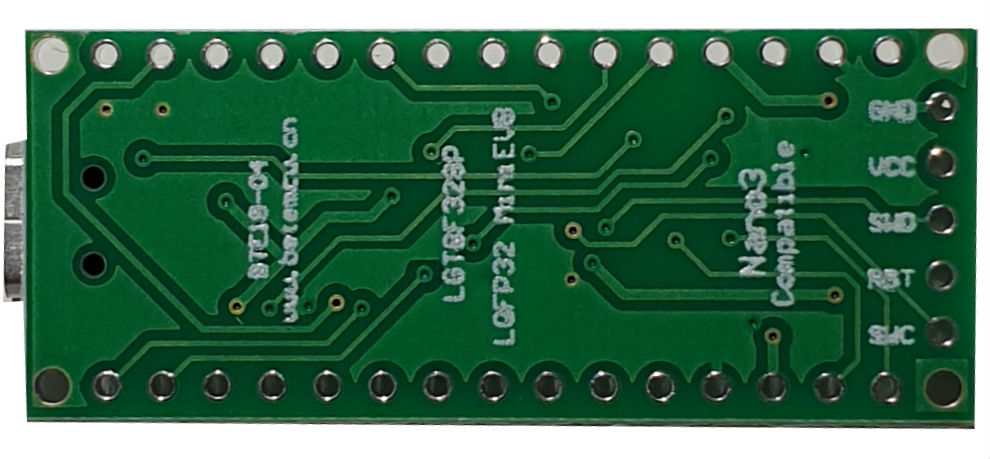
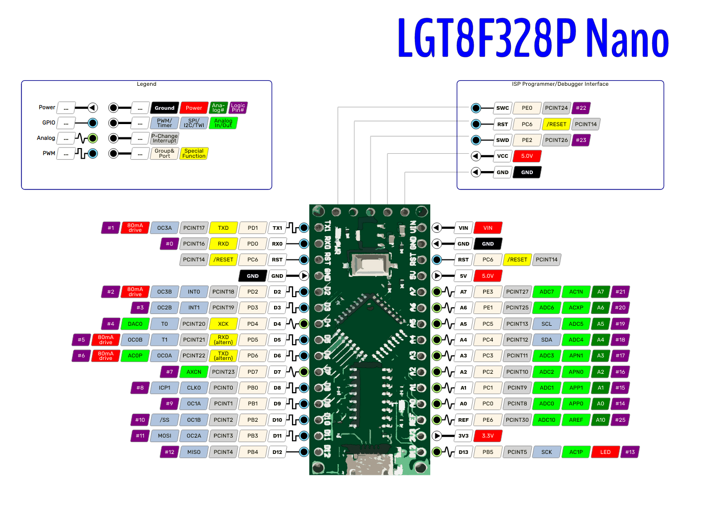
Like this pinout?

[Create](./docs/boards/pinouts) more pinouts for the other boards!

### Uno Style LQFP32

### [Wemos TTGO XI](../../wiki/Wemos-TTGO-XI)

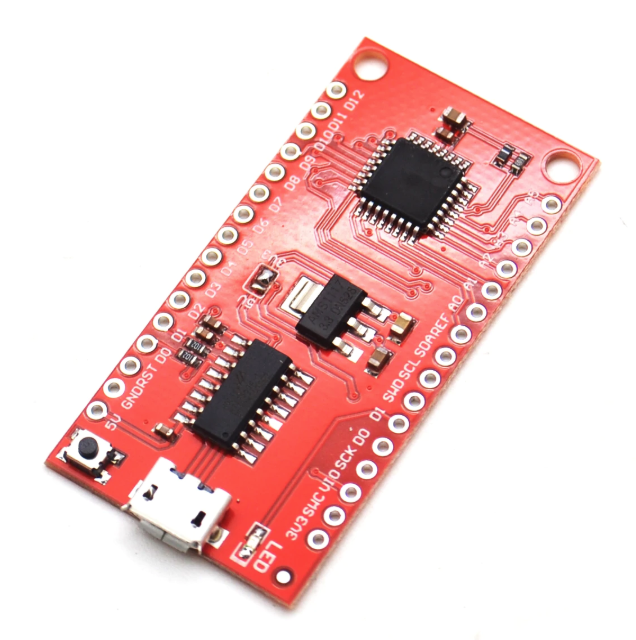
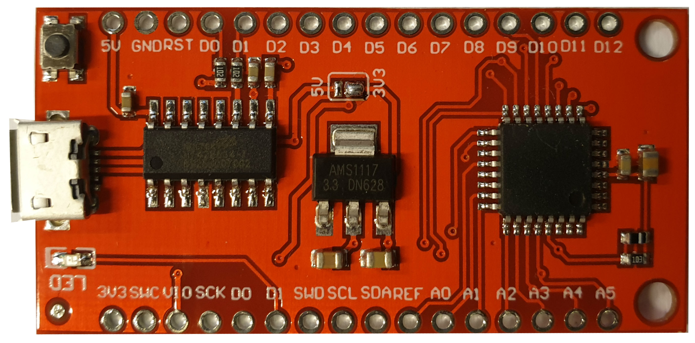

## LGT8F328P-SSOP20

### [Pro Mini Style SSOP20](../../wiki/Pro-Mini-Style---SSOP20)

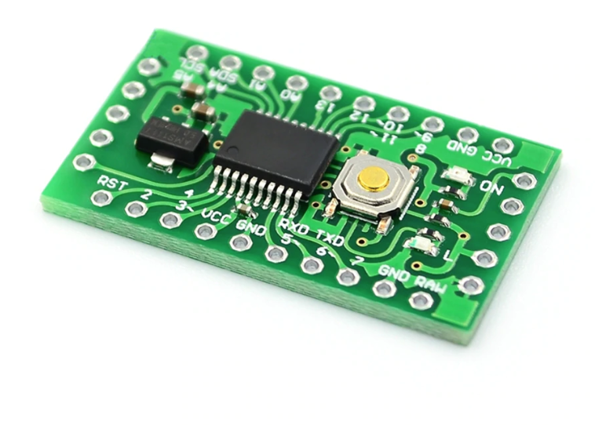
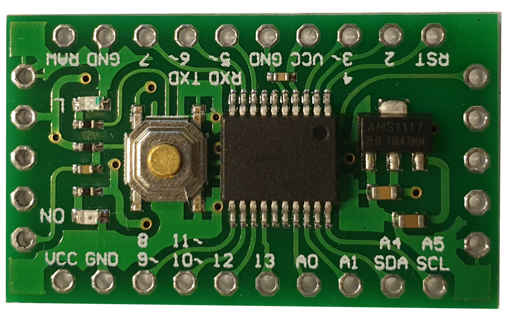
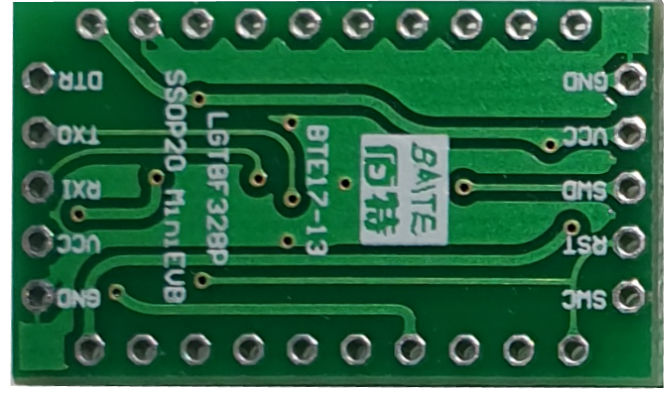

## LGT8F328P-LQFP48

# Docs & links

- Check the [Wiki](https://github.com/dbuezas/lgt8fx/wiki) for more content by contribuitors
- And you may also find something in the closed [Issues](https://github.com/dbuezas/lgt8fx/issues?utf8=%E2%9C%93&q=is%3Aissue)
- Core is based on [Larduino_HSP v3.6c](https://github.com/Edragon/LGT/tree/master/HSP%20Patch%20File/Larduino_HSP_3.6c/Larduino_HSP_v3.6c) with fastIO backported from https://github.com/LGTMCU/Larduino_HSP
- And inspired from Ralph Bacon's video: https://youtu.be/Myfeqrl3QP0 (Check his channel, he's uploaded a lot of great videos)
- Great place to gather data about this boards: https://github.com/RalphBacon/LGT8F328P-Arduino-Clone-Chip-ATMega328P
- Datasheet [(Chinese) LGT8FX8P_databook_V1.04](./docs/LGT8FX8P_databook_v1.0.4.ch.pdf)
- Datasheet [(English) LGT8FX8P_databook_V1.04](./docs/LGT8FX8P_databook_v1.0.4.en.pdf) thanks to [#metallurge](https://github.com/RalphBacon/LGT8F328P-Arduino-Clone-Chip-ATMega328P/issues/2#issuecomment-517952757)
- Datasheet [(English) LGT8FX8P_databook_V1.05](https://github.com/watterott/LGT8F328P-Testing/raw/master/LGT8FX8P_databook_v1.0.5-English.pdf) By [Watterrott](https://github.com/watterott/LGT8F328P-Testing)
- [Instruction set clk vs avr](https://docs.google.com/spreadsheets/d/1EzwMkWOIMNDqnjpbzuchsLx5Zq_j927tvAPgvmSuP6M/edit?usp=sharing) By unknown, claim if you are the author
- [Work on the differential amplifier](./docs/differential-amplifier/readme.md)
- "Forbiden tech from China has arrived" https://www.avrfreaks.net/forum/forbiden-tech-china-has-arrived?page=all
- Larduino ISP for 328d https://github.com/Edragon/LGT/tree/master/Toolchain/ISP/LarduinoISP-master
- https://www.eevblog.com/forum/projects/anyone-here-interested-in-the-logic-green-avrs-lgt8f328p/
- http://coultersmithing.com/forums/viewtopic.php?f=6&t=1149
- LGT SDK Builder
  - "very useful during development, hopefully others can find it helpful too." @sengit
  - Document page : http://www.lgtic.com/2017/11/11/lgtsdk_builder/
  - Download link : http://www.lgtic.com/upload/tools/lgtsdk_builder/LGTSDK_Builder_latest.rar

PS: Just want to say thanks for this git, helped me a lot!
# Disclamer

I have no association with Arduino, Logic Green, Atmel or anything. I just wanted to have a convenient way to use these boards and get them to work without hacks at max speed

# Download stats

https://tooomm.github.io/github-release-stats/?username=dbuezas&repository=lgt8fx

# Thanks

- [#Larduino_HSP](https://github.com/LGTMCU/Larduino_HSP) for doing 99.9999% of the work
- [#RalphBacon](https://github.com/RalphBacon) introducing most of us to the board
- [#dcfusor](https://github.com/dcfusor) for help with fast io backporting
- [#HI-SEBA](https://github.com/HI-SEBA) for help with software serial
- [#dwillmore](https://github.com/dwillmore) for creating the wiki, serial adapter troubleshooting, more examples of boards and wemos-TTGO-XI board support
- [#seisfeld](https://github.com/seisfeld) for adding in-menu support for an external oscillator
- [#jg1uaa](https://github.com/jg1uaa) for the updated Software Serial without timing tables and missing methods
- [#LaZsolt](https://github.com/LaZsolt) for adding SSOP20 lgt8f328p support and precise delayMicroseconds
- [#jayzakk](https://github.com/jayzakk) for fixing the ADC prescaler for faster analog reads
